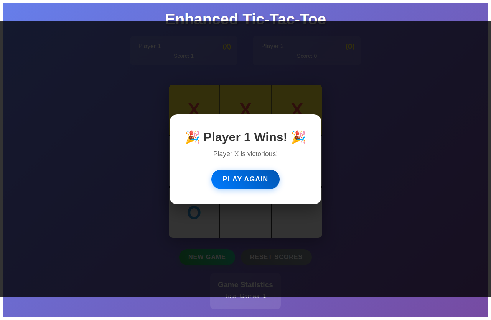
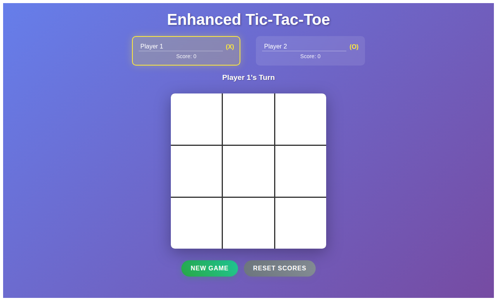
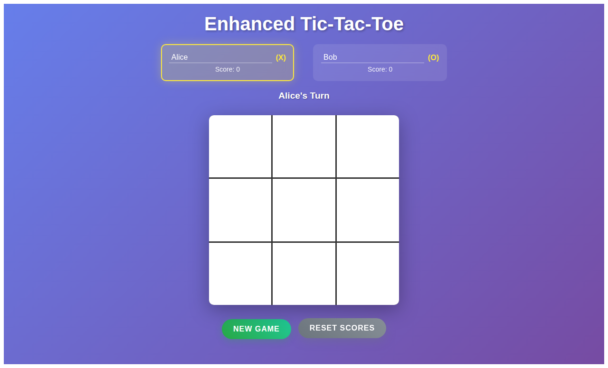

# Enhanced Tic-Tac-Toe

A modern, beautiful, and feature-rich tic-tac-toe game built with Angular 18, featuring full Node.js 22 support, stunning UI, player customization, score tracking, and smooth animations.



## 🚀 Node.js 22 Ready!

✅ **Fully Compatible with Node.js 22**  
✅ **Latest Angular 18.2.0**  
✅ **Modern Standalone Components**  
✅ **Updated Dependencies for Current Node Versions**

## 🛠️ Requirements

- **Node.js**: 18.x, 20.x, or **22.x** (latest supported!)
- **npm**: 8.x or higher
- **Modern Browser**: Chrome, Firefox, Safari, or Edge

## ✨ Features

### 🎮 Game Features
- **Classic Tic-Tac-Toe Gameplay**: Traditional 3x3 grid with X and O markers
- **Smart Winner Detection**: Automatic detection of winning combinations (rows, columns, diagonals)
- **Draw Detection**: Properly handles tie games
- **Visual Winner Highlighting**: Winning combinations are highlighted with glowing animation

### 👤 Player Customization
- **Editable Player Names**: Click on player names to customize them
- **Real-time Turn Indicator**: Shows whose turn it is with custom names
- **Active Player Highlighting**: Current player is visually highlighted

### 📊 Score Tracking & Statistics
- **Persistent Score Tracking**: Keeps score across multiple games
- **Game Statistics**: Shows total games played
- **Score Reset**: Reset all scores and statistics with one click

### 🎨 Modern UI & UX
- **Stunning Gradient Background**: Beautiful purple-blue gradient
- **Smooth Animations**: 
  - Mark appearance animations when placing X/O
  - Winner highlighting with pulsing effect
  - Button hover effects with elevation
  - Modal slide-in animations
- **Responsive Design**: Works perfectly on desktop, tablet, and mobile
- **Modern Button Styling**: Gradient buttons with hover effects
- **Glass-morphism Elements**: Semi-transparent containers with blur effects

### 🏆 Game Results
- **Victory Modal**: Beautiful modal overlay announcing the winner
- **Celebration Elements**: Emoji and styled text for wins
- **Play Again**: Quick restart without losing scores

## 🚀 Getting Started

### Prerequisites
- Node.js (version 12 or higher)
- npm (Node Package Manager)

### Installation

1. Clone the repository:
```bash
git clone https://github.com/Tallerlei/tic-tac-toe.git
cd tic-tac-toe
```

2. Install dependencies:
```bash
npm install
```

3. Start the development server:
```bash
NODE_OPTIONS="--openssl-legacy-provider" npm start
```

4. Open your browser and navigate to:
```
http://localhost:4200
```

### Building for Production

To build the project for production:
```bash
NODE_OPTIONS="--openssl-legacy-provider" npm run build
```

The build artifacts will be stored in the `dist/` directory.

## 🎯 How to Play

1. **Start the Game**: The game begins with Player 1 (X) turn
2. **Customize Names**: Click on "Player 1" or "Player 2" to set custom names
3. **Make Moves**: Click on any empty square to place your mark
4. **Win the Game**: Get three marks in a row (horizontally, vertically, or diagonally)
5. **Track Progress**: Your scores are saved automatically
6. **Play Again**: Click "New Game" for another round or "Play Again" after winning

## 🛠️ Technical Details

### Built With
- **Angular 11**: Modern web application framework
- **TypeScript**: Type-safe JavaScript
- **CSS3**: Modern styling with animations and gradients
- **HTML5**: Semantic markup

### Key Improvements Made

#### 🔧 Code Quality
- **Enhanced TypeScript**: Proper interfaces, type safety, and modern practices
- **Better Architecture**: Separated concerns and improved method organization
- **Error Handling**: Robust game state management

#### 🎨 UI/UX Enhancements
- **Modern Design System**: Consistent colors, typography, and spacing
- **Accessibility**: Proper focus states and interactive elements
- **Performance**: Smooth 60fps animations
- **Mobile-First**: Responsive design that works on all devices

#### ⚡ New Functionality
- **Player Management**: Custom names with persistent storage during game session
- **Advanced Scoring**: Multi-game score tracking with statistics
- **Game History**: Total games played counter
- **Enhanced Feedback**: Visual and textual feedback for all game states

## 📱 Screenshots

### Game in Progress


### Winner Celebration


### Custom Player Names


## 🧪 Testing

Run unit tests:
```bash
npm test
```

Run end-to-end tests:
```bash
npm run e2e
```

## 🎨 Customization

The game uses CSS custom properties and can be easily customized by modifying the styles in the component. Key areas for customization:

- **Colors**: Update the gradient backgrounds and accent colors
- **Animations**: Modify transition durations and effects
- **Layout**: Adjust spacing and sizing for different screen sizes
- **Typography**: Change fonts and text styling

## 🤝 Contributing

1. Fork the repository
2. Create a feature branch: `git checkout -b feature/amazing-feature`
3. Commit your changes: `git commit -m 'Add amazing feature'`
4. Push to the branch: `git push origin feature/amazing-feature`
5. Open a Pull Request

## 📄 License

This project is licensed under the MIT License - see the [LICENSE](LICENSE) file for details.

## 🙏 Acknowledgments

- Built with Angular CLI
- Inspired by classic tic-tac-toe gameplay
- Modern UI design inspired by contemporary web applications

---

**Enjoy playing Enhanced Tic-Tac-Toe! 🎮**
